# 🚀 Spring Boot Microservices Flagship Project

[](https://openjdk.java.net/projects/jdk/21/)
[](https://spring.io/projects/spring-boot)
[](https://gradle.org/)
[](https://www.docker.com/)
[](https://github.com/mikopos/springboot-flagship/actions/workflows/ci-cd.yml)
[](LICENSE)

A comprehensive **microservices architecture** project built with **Spring Boot 3.x** and **Java 21**, demonstrating modern enterprise application development practices. This project showcases a complete e-commerce platform with multiple interconnected services, implementing industry-standard patterns and technologies.

## 📋 Table of Contents

- [🎯 Project Overview](#-project-overview)
- [🏗️ Architecture](#️-architecture)
- [🛠️ Technologies Used](#️-technologies-used)
- [📊 API Endpoints](#-api-endpoints)
- [🚀 Quick Start Guide](#-quick-start-guide)
- [🔧 Configuration](#-configuration)
- [🧪 Testing](#-testing)
- [📊 Monitoring & Observability](#-monitoring--observability)
- [🔒 Security Features](#-security-features)
- [🚀 CI/CD Pipeline](#-cicd-pipeline)
- [📁 Project Structure](#-project-structure)
- [🌐 Deployment Guide](#-deployment-guide)
- [🆘 Troubleshooting](#-troubleshooting)
- [🤝 Contributing](#-contributing)
- [📝 License](#-license)

## 🎯 Project Overview

This project demonstrates proficiency in:

- **Microservices Architecture** - Service decomposition and communication
- **Spring Boot 3.x** - Modern Spring framework features
- **Java 21** - Latest Java features and performance improvements
- **Docker & Docker Compose** - Containerization and orchestration
- **Spring Security** - OAuth2/JWT authentication and authorization
- **Spring Cloud Gateway** - API Gateway pattern implementation
- **Event-Driven Architecture** - Asynchronous communication with Kafka
- **Database Design** - PostgreSQL with JPA/Hibernate
- **Caching** - Redis integration for performance optimization
- **Monitoring** - Prometheus and Grafana integration
- **CI/CD** - GitHub Actions for automated testing and deployment
- **Security** - Vulnerability scanning and dependency management

## 🏗️ Architecture

### System Architecture Diagram

```mermaid
graph TB
    %% External Systems
    Internet[Internet]
    Keycloak[Keycloak<br/>Identity & Access Management]
    PaymentProvider[Payment Provider<br/>External Payment Gateway]
    
    %% Client Applications
    WebApp[Web Application]
    MobileApp[Mobile Application]
    AdminDashboard[Admin Dashboard]
    
    %% API Gateway
    subgraph APIGateway["API Gateway (Port 8081)"]
        Gateway[Spring Cloud Gateway]
        OAuth2[OAuth2 Resource Server]
        CircuitBreaker[Circuit Breaker]
        RateLimiter[Rate Limiter]
    end
    
    %% Microservices
    subgraph UserService["User Service (Port 8082)"]
        UserController[User Controller]
        UserServiceLayer[User Service]
        UserRepository[User Repository]
        UserDB[(PostgreSQL<br/>Users Database)]
    end
    
    subgraph OrderService["Order Service (Port 8083)"]
        OrderController[Order Controller]
        OrderServiceLayer[Order Service]
        OrderRepository[Order Repository]
        OrderDB[(PostgreSQL<br/>Orders Database)]
    end
    
    subgraph PaymentService["Payment Service (Port 8084)"]
        PaymentController[Payment Controller]
        PaymentServiceLayer[Payment Service]
        IdempotencyService[Idempotency Service]
        Resilience4j[Resilience4j]
        PaymentDB[(PostgreSQL<br/>Payments Database)]
    end
    
    subgraph InventoryService["Inventory Service (Port 8085)"]
        InventoryController[Inventory Controller]
        InventoryServiceLayer[Inventory Service]
        ProductRepository[Product Repository]
        InventoryDB[(PostgreSQL<br/>Inventory Database)]
        RedisCache[(Redis Cache)]
    end
    
    subgraph StreamingService["Streaming Service (Port 8086)"]
        StreamingController[Streaming Controller]
        StreamingServiceLayer[Streaming Service]
        WebFlux[WebFlux]
        SSE[Server-Sent Events]
    end
    
    %% Message Broker
    subgraph KafkaCluster["Kafka Cluster"]
        OrderEvents[Order Events Topic]
        PaymentEvents[Payment Events Topic]
        InventoryEvents[Inventory Events Topic]
    end
    
    %% Monitoring
    subgraph Observability["Observability"]
        Prometheus[Prometheus<br/>Metrics Collection]
        Grafana[Grafana<br/>Dashboards]
        Micrometer[Micrometer<br/>Metrics]
    end
    
    %% Infrastructure
    subgraph Infrastructure["Infrastructure"]
        Docker[Docker Containers]
        Kubernetes[Kubernetes Orchestration]
        GitHubActions[GitHub Actions CI/CD]
    end
    
    %% Client to Gateway connections
    WebApp --> Internet
    MobileApp --> Internet
    AdminDashboard --> Internet
    Internet --> Gateway
    
    %% Gateway to Services
    Gateway --> UserController
    Gateway --> OrderController
    Gateway --> PaymentController
    Gateway --> InventoryController
    Gateway --> StreamingController
    
    %% Authentication
    UserController --> Keycloak
    OrderController --> Keycloak
    PaymentController --> Keycloak
    InventoryController --> Keycloak
    StreamingController --> Keycloak
    
    %% External Payment
    PaymentController --> PaymentProvider
    
    %% Event Publishing
    OrderController --> OrderEvents
    PaymentController --> PaymentEvents
    InventoryController --> InventoryEvents
    
    %% Event Subscriptions
    OrderEvents --> PaymentController
    OrderEvents --> InventoryController
    PaymentEvents --> OrderController
    InventoryEvents --> OrderController
    
    %% Database Connections
    UserController --> UserDB
    OrderController --> OrderDB
    PaymentController --> PaymentDB
    InventoryController --> InventoryDB
    InventoryController --> RedisCache
    
    %% Streaming Connections
    StreamingController --> OrderEvents
    StreamingController --> PaymentEvents
    StreamingController --> InventoryEvents
    
    %% Metrics
    UserController --> Micrometer
    OrderController --> Micrometer
    PaymentController --> Micrometer
    InventoryController --> Micrometer
    StreamingController --> Micrometer
    Micrometer --> Prometheus
    Prometheus --> Grafana
    
    %% Infrastructure
    Docker --> Kubernetes
    GitHubActions --> Docker
    GitHubActions --> Kubernetes
    
    %% Styling
    classDef serviceBox fill:#e1f5fe,stroke:#01579b,stroke-width:2px
    classDef databaseBox fill:#f3e5f5,stroke:#4a148c,stroke-width:2px
    classDef externalBox fill:#fff3e0,stroke:#e65100,stroke-width:2px
    classDef monitoringBox fill:#e8f5e8,stroke:#1b5e20,stroke-width:2px
    
    class UserService,OrderService,PaymentService,InventoryService,StreamingService,APIGateway serviceBox
    class UserDB,OrderDB,PaymentDB,InventoryDB,RedisCache databaseBox
    class Keycloak,PaymentProvider,Internet externalBox
    class Observability,Prometheus,Grafana,Micrometer monitoringBox
```



### Service Responsibilities

| Service | Port | Description | Key Features |
|---------|------|-------------|--------------|
| **API Gateway** | 8081 | Central entry point, routing, authentication | OAuth2/JWT, Rate Limiting, Circuit Breakers |
| **User Service** | 8082 | User management, authentication, profiles | Keycloak integration, Activity tracking |
| **Order Service** | 8083 | Order processing, order history, tracking | Event publishing, State management |
| **Payment Service** | 8084 | Payment processing, transactions, refunds | Idempotency, Resilience4j, External providers |
| **Inventory Service** | 8085 | Product catalog, stock management | Redis caching, Real-time updates |
| **Streaming Service** | 8086 | Real-time data streaming, event processing | WebFlux, Server-Sent Events |

## 🛠️ Technologies Used

### Backend Technologies
- **Java 21** - Latest LTS version with modern features
- **Spring Boot 3.5.5** - Latest stable version
- **Spring Cloud Gateway** - API Gateway implementation
- **Spring Security** - OAuth2/JWT authentication
- **Spring Data JPA** - Database abstraction layer
- **Spring Data Redis** - Caching and session management
- **Spring Kafka** - Event-driven messaging
- **Spring WebFlux** - Reactive programming for streaming
- **Hibernate** - ORM framework
- **Gradle** - Build and dependency management

### Databases & Caching
- **PostgreSQL 15** - Primary relational database
- **Redis 7** - In-memory caching and session store
- **Apache Kafka** - Event streaming platform

### Infrastructure & DevOps
- **Docker** - Containerization
- **Docker Compose** - Multi-container orchestration
- **Kubernetes** - Container orchestration
- **Prometheus** - Metrics collection and monitoring
- **Grafana** - Metrics visualization and dashboards
- **GitHub Actions** - CI/CD pipeline
- **Trivy** - Container vulnerability scanning

### Security & Quality
- **OWASP Dependency Check** - Vulnerability scanning
- **JWT** - Stateless authentication
- **OAuth2** - Authorization framework
- **Keycloak** - Identity and access management
- **Resilience4j** - Circuit breakers and resilience patterns

## 📊 API Endpoints

### API Gateway Routes
All services are accessible through the API Gateway at `http://localhost:8081`:

| Route | Target Service | Description |
|-------|----------------|-------------|
| `/api/users/**` | User Service | User management endpoints |
| `/api/orders/**` | Order Service | Order processing endpoints |
| `/api/payments/**` | Payment Service | Payment processing endpoints |
| `/api/inventory/**` | Inventory Service | Product and inventory endpoints |
| `/api/stream/**` | Streaming Service | Real-time streaming endpoints |
| `/actuator/health` | All Services | Health check endpoints |

### User Service API (`/api/users`)

| Method | Endpoint | Description | Auth Required |
|--------|----------|-------------|---------------|
| `POST` | `/api/users` | Create new user | Admin/User Manager |
| `GET` | `/api/users/me` | Get current user profile | User |
| `PUT` | `/api/users/me` | Update current user profile | User |
| `GET` | `/api/users/{id}` | Get user by ID | Admin/User Manager/Owner |
| `PUT` | `/api/users/{id}` | Update user by ID | Admin/User Manager/Owner |
| `GET` | `/api/users` | Get all users (paginated) | Admin/User Manager |
| `GET` | `/api/users/activity` | Get user activity history | User |
| `GET` | `/actuator/health` | Health check | None |

### Order Service API (`/api/orders`)

| Method | Endpoint | Description | Auth Required |
|--------|----------|-------------|---------------|
| `POST` | `/api/orders` | Create new order | User |
| `GET` | `/api/orders/{id}` | Get order by ID | Admin/Order Manager/Owner |
| `GET` | `/api/orders/number/{orderNumber}` | Get order by number | Admin/Order Manager/Owner |
| `GET` | `/api/orders/my-orders` | Get current user's orders | User |
| `PUT` | `/api/orders/{id}/status` | Update order status | Admin/Order Manager |
| `GET` | `/api/orders` | Get all orders (paginated) | Admin/Order Manager |
| `GET` | `/api/orders/status/{status}` | Get orders by status | Admin/Order Manager |
| `GET` | `/actuator/health` | Health check | None |

### Payment Service API (`/api/payments`)

| Method | Endpoint | Description | Auth Required |
|--------|----------|-------------|---------------|
| `POST` | `/api/payments` | Create new payment | User |
| `POST` | `/api/payments/{paymentId}/process` | Process payment | Admin/Payment Manager/Owner |
| `POST` | `/api/payments/{paymentId}/idempotentprocess` | Process payment with idempotency | Admin/Payment Manager/Owner |
| `GET` | `/api/payments/{id}` | Get payment by ID | Admin/Payment Manager/Owner |
| `GET` | `/api/payments/payment-id/{paymentId}` | Get payment by payment ID | Admin/Payment Manager/Owner |
| `GET` | `/api/payments/my-payments` | Get current user's payments | User |
| `GET` | `/api/payments/order/{orderId}` | Get payments by order ID | Admin/Payment Manager/Owner |
| `POST` | `/api/payments/{paymentId}/refund` | Refund payment | Admin/Payment Manager |
| `PUT` | `/api/payments/{paymentId}/cancel` | Cancel payment | Admin/Payment Manager/Owner |
| `GET` | `/api/payments/status/{status}` | Get payments by status | Admin/Payment Manager |
| `GET` | `/api/payments/date-range` | Get payments by date range | Admin/Payment Manager |
| `GET` | `/actuator/health` | Health check | None |

### Inventory Service API (`/api/inventory`)

| Method | Endpoint | Description | Auth Required |
|--------|----------|-------------|---------------|
| `POST` | `/api/inventory/products` | Create new product | Admin/Inventory Manager |
| `GET` | `/api/inventory/products/{id}` | Get product by ID | None |
| `GET` | `/api/inventory/products/sku/{sku}` | Get product by SKU | None |
| `PUT` | `/api/inventory/products/{id}` | Update product | Admin/Inventory Manager |
| `POST` | `/api/inventory/products/{productId}/inventory` | Update product inventory | Admin/Inventory Manager |
| `GET` | `/api/inventory/products` | Get all products (paginated) | None |
| `GET` | `/api/inventory/products/search` | Search products | None |
| `GET` | `/api/inventory/products/category/{category}` | Get products by category | None |
| `GET` | `/api/inventory/products/low-stock` | Get low stock products | Admin/Inventory Manager |
| `GET` | `/actuator/health` | Health check | None |

### Streaming Service API (`/api/stream`)

| Method | Endpoint | Description | Auth Required |
|--------|----------|-------------|---------------|
| `GET` | `/api/stream/events` | Stream all events (SSE) | User |
| `GET` | `/api/stream/events/types/{eventTypes}` | Stream events by type (SSE) | User |
| `GET` | `/api/stream/events/sources/{sources}` | Stream events by source (SSE) | User |
| `GET` | `/api/stream/events/user` | Stream user-specific events (SSE) | User |
| `GET` | `/api/stream/events/session/{sessionId}` | Stream session events (SSE) | User |
| `GET` | `/api/stream/stats` | Get streaming statistics | User |
| `GET` | `/api/stream/stats/user/{userId}` | Get user streaming statistics | User |
| `GET` | `/actuator/health` | Health check | None |

## 🚀 Quick Start Guide

### Prerequisites

Before running this project, ensure you have the following installed:

- **Java 21**
- **Docker** and **Docker Compose**
- **Gradle 8.5+**
- **Git**

### Option 1: Docker Compose (Recommended)

1. **Clone the repository**
   ```bash
   git clone https://github.com/mikopos/springboot-flagship.git
   cd springboot-flagship
   ```

2. **Start all services with Docker Compose**
   ```bash
   docker-compose up -d
   ```

3. **Wait for services to start** (approximately 2-3 minutes)
   ```bash
   # Check service status
   docker-compose ps
   
   # View logs
   docker-compose logs -f
   ```

4. **Access the application**
   - **API Gateway**: http://localhost:8081
   - **Keycloak Admin**: http://localhost:8080 (admin/admin)
   - **Grafana**: http://localhost:3000 (admin/admin)
   - **Prometheus**: http://localhost:9090

### Option 2: Local Development

1. **Start infrastructure services**
   ```bash
   docker-compose up -d postgres redis kafka zookeeper keycloak
   ```

2. **Build and run services locally**
   ```bash
   # Build all services
   ./gradlew build -x test
   
   # Run each service (in separate terminals)
   java -jar services/api-gateway/build/libs/api-gateway-1.0.0.jar
   java -jar services/user-service/build/libs/user-service-1.0.0.jar
   java -jar services/order-service/build/libs/order-service-1.0.0.jar
   java -jar services/payment-service/build/libs/payment-service-1.0.0.jar
   java -jar services/inventory-service/build/libs/inventory-service-1.0.0.jar
   java -jar services/streaming-service/build/libs/streaming-service-1.0.0.jar
   ```

## 🔧 Configuration

### Environment Variables

The application uses the following key environment variables:

```bash
# Database Configuration
SPRING_DATASOURCE_URL=jdbc:postgresql://postgres:5432/flagship_db
SPRING_DATASOURCE_USERNAME=flagship_user
SPRING_DATASOURCE_PASSWORD=flagship_password

# Redis Configuration
SPRING_DATA_REDIS_HOST=redis
SPRING_DATA_REDIS_PORT=6379

# Kafka Configuration
SPRING_KAFKA_BOOTSTRAP_SERVERS=kafka:9092

# Keycloak Configuration
KEYCLOAK_ISSUER_URI=http://keycloak:8080/realms/flagship
KEYCLOAK_JWK_SET_URI=http://keycloak:8080/realms/flagship/protocol/openid-connect/certs
```

### Profiles

The application supports multiple profiles:
- **default** - Local development
- **docker** - Docker containerized environment
- **test** - Testing environment

## 🧪 Testing

### Run Tests
```bash
# Run all tests
./gradlew test

# Run tests for specific service
./gradlew :services:user-service:test

# Run with Docker
docker-compose -f docker-compose.test.yml up --abort-on-container-exit
```

### API Testing

#### Getting JWT Token

1. **Access Keycloak Admin Console**
   - URL: http://localhost:8080
   - Username: `admin`
   - Password: `admin`

2. **Create a test user** in Keycloak admin console

3. **Get JWT token using the helper script:**
   ```bash
   # Make script executable (if not already)
   chmod +x scripts/get-token.sh
   
   # Get token (replace with your credentials)
   ./scripts/get-token.sh your-username your-password
   ```

4. **Or get token manually:**
   ```bash
   curl -X POST http://localhost:8080/realms/flagship/protocol/openid-connect/token \
     -H "Content-Type: application/x-www-form-urlencoded" \
     -d "username=your-username" \
     -d "password=your-password" \
     -d "grant_type=password" \
     -d "client_id=flagship-client"
   ```

#### Testing API Endpoints

```bash
# Health check (no auth required)
curl http://localhost:8081/actuator/health

# Test all endpoints with JWT token
./scripts/test-api.sh

# Or test individual endpoints
curl -H "Authorization: Bearer YOUR_JWT_TOKEN" \
  http://localhost:8081/api/inventory/products

curl -H "Authorization: Bearer YOUR_JWT_TOKEN" \
  http://localhost:8081/api/users/me

curl -H "Authorization: Bearer YOUR_JWT_TOKEN" \
  http://localhost:8081/api/orders/my-orders
```

## 📊 Monitoring & Observability

### Prometheus Metrics
- **Endpoint**: http://localhost:9090
- **Metrics**: JVM, HTTP requests, database connections, custom business metrics

### Grafana Dashboards
- **Endpoint**: http://localhost:3000
- **Login**: admin/admin
- **Dashboards**: Microservices overview, JVM metrics, business metrics

### Application Health
- **Health Checks**: http://localhost:8081/actuator/health
- **Metrics**: http://localhost:8081/actuator/metrics
- **Info**: http://localhost:8081/actuator/info

## 🔒 Security Features

- **JWT Authentication** - Stateless token-based authentication
- **OAuth2 Authorization** - Role-based access control
- **API Gateway Security** - Centralized security policies
- **Dependency Scanning** - Automated vulnerability detection
- **Container Security** - Trivy scanning in CI/CD pipeline

## 🚀 CI/CD Pipeline

The project includes a comprehensive GitHub Actions workflow:

1. **Code Quality Checks**
   - Gradle compilation
   - Unit tests execution
   - Code coverage reporting

2. **Security Scanning**
   - OWASP dependency check
   - Trivy container scanning
   - SARIF report generation

3. **Build & Deploy**
   - Docker image building
   - Container registry push
   - Automated deployment

## 📁 Project Structure

```
springboot-flagship/
├── services/                    # Microservices
│   ├── api-gateway/            # API Gateway service
│   ├── user-service/           # User management service
│   ├── order-service/          # Order processing service
│   ├── payment-service/        # Payment processing service
│   ├── inventory-service/      # Inventory management service
│   └── streaming-service/      # Event streaming service
├── k8s/                        # Kubernetes deployment files
├── monitoring/                 # Prometheus & Grafana configs
├── docs/                       # Documentation
├── scripts/                    # Helper scripts
├── docker-compose.yml          # Docker Compose configuration
├── build.gradle                # Root Gradle build file
├── settings.gradle             # Gradle settings
├── gradlew                     # Gradle wrapper
├── gradlew.bat                 # Gradle wrapper (Windows)
├── gradle/                     # Gradle wrapper files
└── README.md                   # This file
```

## 🌐 Deployment Guide

### Local Development Deployment

1. **Prerequisites Setup**
    - Install Docker and Docker Compose
    - Install Java 21
    - Install Gradle 8.5+ (or use the included wrapper)


2. **Clone and Start**
   ```bash
   git clone https://github.com/mikopos/springboot-flagship.git
   cd springboot-flagship
   docker-compose up -d
   ```

### Production Deployment

#### Docker Swarm Deployment

1. **Initialize Swarm**
   ```bash
   docker swarm init
   ```

2. **Deploy Stack**
   ```bash
   docker stack deploy -c docker-compose.prod.yml flagship
   ```

#### Kubernetes Deployment

1. **Prerequisites**
   - Kubernetes cluster (minikube, GKE, EKS, AKS)
   - kubectl configured
   - Helm (optional)

2. **Deploy Infrastructure**
   ```bash
   # Deploy PostgreSQL
   kubectl apply -f k8s/infrastructure/postgres-deployment.yaml
   
   # Deploy Redis
   kubectl apply -f k8s/infrastructure/redis-deployment.yaml
   
   # Deploy Kafka
   kubectl apply -f k8s/infrastructure/kafka-deployment.yaml
   
   # Deploy Keycloak
   kubectl apply -f k8s/infrastructure/keycloak-deployment.yaml
   ```

3. **Deploy Services**
   ```bash
   # Deploy all microservices
   kubectl apply -f k8s/
   ```

4. **Verify Deployment**
   ```bash
   kubectl get pods
   kubectl get services
   ```

#### Cloud Deployment (AWS/GCP/Azure)

1. **Container Registry Setup**
   ```bash
   # Build and push images
   docker build -t <your-registry>/flagship-api-gateway:latest services/api-gateway/
   docker push <your-registry>/flagship-api-gateway:latest
   ```

2. **Kubernetes Configuration**
   - Update image references in k8s/*.yaml files
   - Configure cloud-specific services (LoadBalancer, Ingress)
   - Set up persistent volumes for databases

3. **Deploy**
   ```bash
   kubectl apply -f k8s/
   ```

### Environment-Specific Configurations

#### Development
- Use Docker Compose with local volumes
- Enable debug logging
- Use in-memory databases for testing

#### Staging
- Use managed databases (RDS, Cloud SQL)
- Enable monitoring and alerting
- Use staging-specific configurations

#### Production
- Use managed services (RDS, ElastiCache, MSK)
- Enable all security features
- Use production-grade monitoring
- Implement backup and disaster recovery

## 🆘 Troubleshooting

### Common Issues

1. **Port conflicts**: Ensure ports 8080-8086, 5432, 6379, 9092, 9090, 3000 are available
2. **Memory issues**: Increase Docker memory allocation to at least 4GB
3. **Service startup**: Wait for all services to be healthy before testing
4. **Database connection**: Ensure PostgreSQL is running and accessible
5. **Redis connection**: Check Redis connectivity and configuration
6. **Kafka issues**: Verify Kafka and Zookeeper are running properly

### Useful Commands

```bash
# Check service health
docker-compose ps

# View service logs
docker-compose logs -f <service-name>

# Restart a service
docker-compose restart <service-name>

# Clean up everything
docker-compose down -v
docker system prune -a

# Check container logs
docker logs <container-name>

# Access container shell
docker exec -it <container-name> /bin/bash

# Check network connectivity
docker network ls
docker network inspect flagship-network
```

### Debugging Steps

1. **Check Service Status**
   ```bash
   docker-compose ps
   curl http://localhost:8081/actuator/health
   ```

2. **View Logs**
   ```bash
   docker-compose logs -f api-gateway
   docker-compose logs -f user-service
   ```

3. **Test Database Connection**
   ```bash
   docker exec -it flagship-postgres psql -U flagship_user -d flagship_db
   ```

4. **Test Redis Connection**
   ```bash
   docker exec -it flagship-redis redis-cli ping
   ```

5. **Test Kafka**
   ```bash
   docker exec -it flagship-kafka kafka-topics --bootstrap-server localhost:9092 --list
   ```

### Performance Optimization

1. **JVM Tuning**
   ```bash
   # Add to docker-compose.yml
   environment:
     JAVA_OPTS: "-Xms512m -Xmx1024m -XX:+UseG1GC"
   ```

2. **Database Optimization**
   - Enable connection pooling
   - Configure appropriate buffer sizes
   - Use read replicas for read-heavy workloads

3. **Caching Strategy**
   - Implement Redis caching for frequently accessed data
   - Use appropriate TTL values
   - Implement cache invalidation strategies

## 🤝 Contributing

1. Fork the repository
2. Create a feature branch (`git checkout -b feature/amazing-feature`)
3. Commit your changes (`git commit -m 'Add some amazing feature'`)
4. Push to the branch (`git push origin feature/amazing-feature`)
5. Open a Pull Request

### Development Guidelines

- Follow Java coding standards
- Write comprehensive tests
- Update documentation
- Ensure all tests pass
- Follow semantic versioning

## 📝 License

This project is licensed under the MIT License - see the [LICENSE](LICENSE) file for details.

## 📞 Support

If you encounter any issues or have questions:

1. Check the [Issues](https://github.com/mikopos/springboot-flagship/issues) page
2. Create a new issue with detailed information
3. Include logs and error messages
4. Provide steps to reproduce the issue

---

**Built with ❤️ using Spring Boot, Java 21, and modern microservices patterns**

*Copyright (c) 2025 Marios Gavriil*